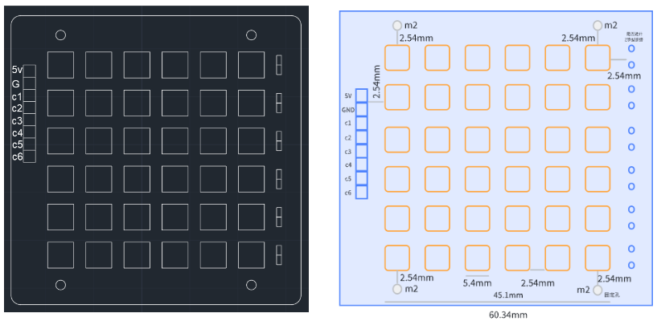
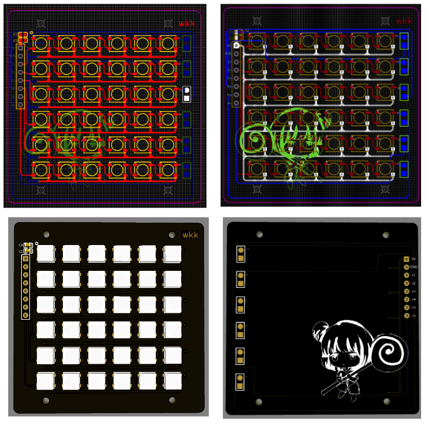

# ColorLights

## 一、硬件设计






## 二、软件设计

MCU: stm32f103c8t6

### 2.1 延时函数

滴答定时器中提供了延时`111ns`的函数

```c
void delay_n111ns(u32 n111ns){
	u32 temp;
	SysTick -> LOAD = n111ns * fac_111ns;		    //reload value
	SysTick -> VAL |= 0x00;		                    // reset to 0
	SysTick -> CTRL |= SysTick_CTRL_ENABLE_Msk;		// start timer
	// conduct whether is zero state
	do{
		temp = SysTick -> CTRL;	// timer state value
	}while(temp & 0x01 && !(temp & (1 << 16)));
	SysTick -> CTRL &= ~SysTick_CTRL_ENABLE_Msk;	// disable timer
	SysTick -> VAL |= 0x00;		                    //reset to 0
}
```

### 2.2 驱动函数

````c
// user operator
#define WS2812_WIDTH   6         // 矩阵排列灯珠的宽度
#define WS2812_HEIGHT  6         // 矩阵排列灯珠的高度
#define WS2812_NUM     (WS2812_WIDTH * WS2812_HEIGHT)

// just the function of "WS2812_Update" can show the color actually
void WS2812_AllinOneColor(COLOR_TYPE * color);
void (COLOR_TYPE * color,u8 x, u8 y ) ;
void WS2812_Update(void);

#endif
````

**函数说明**

1. `WS2812_AllinOneColor`

   将全部灯珠设置为相同的颜色，参数为颜色

2. `WS2812_SetUnitColor`
   将坐标`(x,y)`处的灯珠设置为指定的颜色

3. `WS2812_Update`

   将颜色设置参数发送到灯珠上。`WS2812_AllinOneColor`函数和`WS2812_SetUnitColor`只是将颜色设置到内存中的数组中，`WS2812_Update`才会实际上显示。

   
